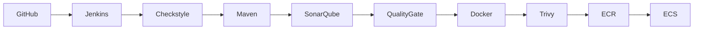

# VProfile: Jenkins CI/CD Pipeline

 

This Jenkins pipeline builds, tests, scans, containerizes, and deploys the VProfile application to AWS ECS.

 

## 🏗️ Architecture:

 

 

## ⚙️ Pipeline Stages

1. Clone Repository
Pulls source code from GitHub.

2. Code Quality
Runs Checkstyle validation.

3. Build Application
Compiles and packages WAR file using Maven.

4. SonarQube Analysis
Performs static code analysis.

5. Quality Gate
Pipeline stops if quality gate fails.

6. Docker Build:
Builds Docker image.

7. Trivy Scan:
Security scan for vulnerabilities.

8. Push to AWS ECR:
Authenticates and pushes image to ECR.

9. Deploy to AWS ECS:
Updates ECS service:

- First deploy → bootstrap, only load image to ECR
- Later deploys → load image to ECR → create new deployment

🚀 How to Run:
Follow the [Setup Instructions](./docs/Setup_Instructions.md)

 

 

## Required Jenkins Plugins

- Pipeline
- Docker Pipeline
- AWS Credentials
- SonarQube Scanner
- Configuration as Code
- Job DSL

 

## Environment Variables

 

Required environment variables:

| Variable | Description |
|----------|-------------|
| AWS_REGION | AWS Region |
| ECR_REGISTRY | ECR Registry |
| PRIVATE_SUBNETS | ECS networking |
| ECS_SECURITY_GROUP | Security Group |

⬅️ [Back to README](../README.md)