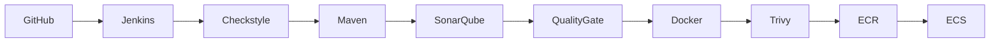

# VProfile: Jenkins CI/CD Pipeline

 

This Jenkins pipeline implements an end-to-end CI/CD workflow for the VProfile application, from source code validation and security scanning through containerization and automated deployment to AWS ECS.

 

## 🏗️ Architecture

## ⚙️ Pipeline Stages

1. Clone Repository
Pulls source code from GitHub.

2. Code Quality
Runs Checkstyle validation to enforce coding standards.

3. Build Application
Compiles and packages the application into a WAR file using Maven.

4. SonarQube Analysis
Performs static code analysis for bugs, vulnerabilities, and code smells.

5. Quality Gate
Fails the pipeline if quality standards are not met.

6. Docker Build
Builds a Docker image for the application.

7. Trivy Scan
Scans the Docker image for vulnerabilities.

8. Push to AWS ECR
Authenticates with AWS and pushes the Docker image to Amazon ECR.

9. Deploy to AWS ECS
Updates the ECS service with the new container image:

- First deployment → bootstrap phase (image is created and stored in ECR)
- Subsequent deployments → rolling updates of the ECS service

 

## 🚀 How to Run:
Follow [CI/CD Setup Instructions](../docs/CI-CD_Setup_Instructions.md)

  

## 🔌 Required Jenkins Plugins

- Pipeline
- Docker Pipeline
- AWS Credentials
- SonarQube Scanner
- Configuration as Code
- Job DSL

 

## 🌍 Environment Variables

| Variable | Description |
|----------|-------------|
| `AWS_REGION` | AWS region used for deployment |
| `ECR_REGISTRY` | Amazon ECR registry URL |
| `PRIVATE_SUBNETS` | Subnets used for ECS tasks |
| `ECS_SECURITY_GROUP` | Security group for ECS services |

 

---

⬅️ [Back to README](../README.md)