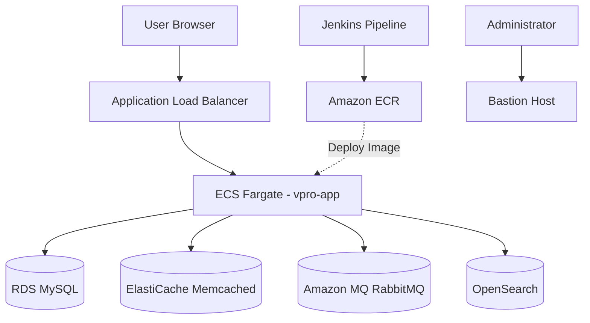

# VProfile – End-to-End DevOps CI/CD Pipeline on AWS

<br>

This project demonstrates a complete DevOps workflow for building, analyzing, securing, containerizing, and deploying a Java web application to AWS using modern DevOps tools and Infrastructure as Code.

> **Workflow:** Terraform → Jenkins → SonarQube → Trivy → Amazon ECR → Amazon ECS

<br>


<br>

## Key Features

### Infrastructure

- Infrastructure as Code with Terraform
- AWS VPC with public and private subnets
- ECS Fargate deployment
- Application Load Balancer

### CI/CD

- Jenkins Pipeline
- Maven Build
- Docker Image Build
- Amazon ECR Push
- ECS Rolling Deployment

### Quality & Security

- Checkstyle
- SonarQube Quality Gates
- Trivy Vulnerability Scanning

### Cloud Services

- Amazon RDS
- Amazon MQ
- Amazon ElastiCache
- Amazon OpenSearch
- Systems Manager (SSM)

<br><br>

## Project Structure

```text
.
├── Docker-files/
├── docs/
├── Jenkins/
├── SonarQube/
├── src/
├── terraform/
├── terraform-ecr/
├── docker-compose.yml
├── pom.xml
└── README.md
```

<br><br>

## 📌 Overview

This project demonstrates a production-style CI/CD workflow for deploying the VProfile Java application to AWS.

The infrastructure is provisioned using Terraform, while Jenkins automates the complete software delivery lifecycle-from source code checkout to deployment on Amazon ECS.

For development and testing, the same application can also be executed locally using Docker Compose.

The project is designed to showcase modern DevOps practices, including Infrastructure as Code, Continuous Integration, Continuous Delivery, automated quality checks, and security scanning.

<br><br>

## Architecture Overview

The following diagram illustrates the high-level AWS architecture used to deploy the application.

<br>





The application runs on Amazon ECS behind an Application Load Balancer. During deployment, Amazon ECS pulls the application image from Amazon ECR and connects to Amazon RDS, ElastiCache, Amazon MQ, and OpenSearch within private subnets.

<br><br>

## 📚 Documentation

- [About the Application](./docs/About_the_Application.md)
- [CI/CD Setup Instructions](./docs/CI-CD_Setup_Instructions.md)
- [Jenkins Pipeline](./Jenkins/README.md)
- [SonarQube Quality Gate](./SonarQube/README.md)
- [Terraform ECR Bootstrap](./terraform-ecr/README.md)
- [Terraform Infrastructure](./terraform/README.md)

<br><br>

## Deployment Environments

The application can be run either locally for development or on AWS for production-style deployment.

<br>

| Component | Local Development | AWS Deployment |
|-----------|-------------------|----------------|
| Application | Spring Application | Amazon ECS (Fargate) |
| Reverse Proxy | Nginx | Application Load Balancer (ALB) |
| Database | MySQL | Amazon RDS (MySQL) |
| Cache | Memcached | Amazon ElastiCache |
| Message Broker | RabbitMQ | Amazon MQ |
| Search Engine | Elasticsearch | Amazon OpenSearch |
| Infrastructure | Docker Compose | Terraform |
| Administration | Local Docker Environment | Bastion Host (AWS Systems Manager) |

<br><br>

## 📦 Technologies Used

- **Language**
   - Java 17 + Spring
- **Build Tool**
   - Maven
- **Containerization**
   - Docker
   - Docker Compose
- **CI/CD**
  - Jenkins
- **Infrastructure**
  - Terraform
- **Quality**
  - SonarQube
  - Checkstyle
- **Security**
  - Trivy
- **Cloud**
  - Amazon ECS
  - Amazon ECR
  - Amazon RDS
  - Amazon MQ
  - Amazon ElastiCache
  - Amazon OpenSearch
  - AWS IAM
  - AWS Systems Manager
  - Application Load Balancer

<br><br>

## 🙏 Credits

The original **VProfile** Java application was developed by **Imran Teli** and is used as the sample application for this project:

https://github.com/hkhcoder/vprofile-project

All DevOps automation, AWS infrastructure, and project documentation in this repository were designed and implemented as part of this portfolio project.