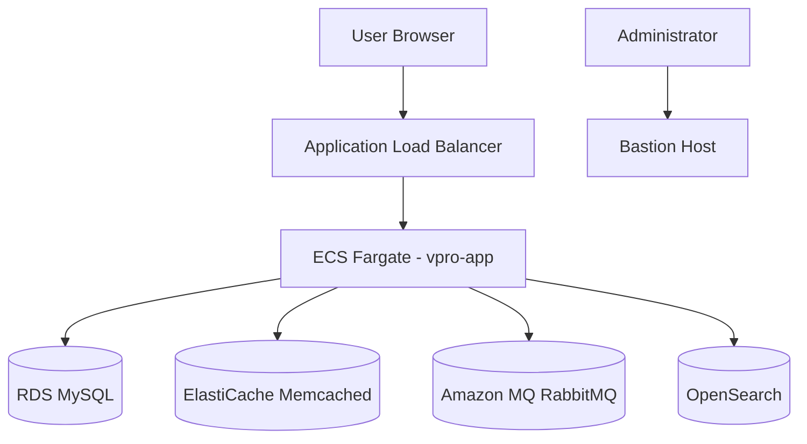
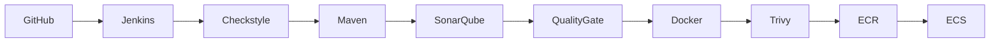

# VProfile - CI/CD DevOps Project

<br>

End-to-end DevOps project demonstrating automated infrastructure provisioning, CI/CD, security scanning, code quality analysis and deployment to AWS ECS.

<br>

### Features:

- Infrastructure as Code with Terraform
- Jenkins CI/CD Pipeline
- SonarQube Code Analysis
- Trivy Security Scanning
- Docker Containerization
- AWS ECS Deployment
- Amazon ECR Integration
- Quality Gate Enforcement
- Least Privilege IAM Policies

<br>

## 📌 Overview

<br>

This project is a full DevOps CI/CD pipeline for deploying a Java Spring-based application into AWS ECS using Terraform, Jenkins, Docker and SonarQube, with an additional option to run the entire system locally using Docker Compose.

<br>

| Local | AWS |
|-------|-----|
| Docker Compose | ECS Fargate |
| MySQL | Amazon RDS |
| RabbitMQ | Amazon MQ |
| Elasticsearch | OpenSearch |
| Memcached | ElastiCache |

<br>

The goal of this project is to validate integration between multiple services:
- MySQL (RDS)
- Memcached
- RabbitMQ
- OpenSearch
- Jenkins CI/CD pipeline
- SonarQube code analysis

<br>



<br>

### Bastion Host:

The infrastructure includes a dedicated Bastion Host located in the public subnet.

Its primary purpose is to:

- Upload the initial MySQL dump into Amazon RDS.
- Provide secure administrative access to resources inside the VPC.
- Perform troubleshooting and debugging tasks when required.

The Bastion Host is managed through AWS Systems Manager (SSM), allowing secure access without opening SSH ports to the internet.

**Start an SSM session:**

```bash
aws ssm start-session --target <BASTION_INSTANCE_ID>
```

Once connected, the Bastion Host can be used to:
- Import the application database into RDS.
- Verify connectivity to RDS, RabbitMQ, OpenSearch, and other private resources.
- Perform operational troubleshooting inside the VPC.

<br>
<br>
<br>

## 📚 Documentation

<br>

- [About the Application](./docs/About_the_Application.md)
- [Setup Instructions](./docs/Setup_Instructions.md)
- [Jenkins Setup](./Jenkins/README.md)
- [SonarQube Setup](./SonarQube/README.md)
- [Terraform Infrastructure](./terraform/README.md)

<br>
<br>
<br>

## 🏗️ Architecture

This project supports two deployment models:

### Local Environment
- Docker Compose
- Nginx
- Spring Application
- MySQL
- Memcached
- RabbitMQ
- Elasticsearch

### AWS Environment
- Terraform-provisioned infrastructure
- Application Load Balancer (ALB)
- ECS Fargate
- Amazon RDS (MySQL)
- Amazon ElastiCache (Memcached)
- Amazon MQ (RabbitMQ)
- Amazon OpenSearch
- Bastion Host (SSM)

<br>
<br>
<br>


## 🚀 Deployment Option 1: **Local Docker Compose**

<br>

### Prerequisites:
- Docker
- Docker Compose

### Run full stack locally:

```bash
docker-compose up -d
```

### Includes:

- VProfile project (Java Web Application)
- Nginx (Web layer)
- MySQL
- Memcached
- RabbitMQ
- Elasticsearch

<br>

## 🚀 Deployment Option 2: **Jenkins CI/CD → AWS ECS**

### Initial Setup:

❗ To run the Jenkins CI/CD Pipeline, you should follow the [CI/CD Setup Instructions](docs/Setup_Instructions.md).


Jenkins Pipeline:

- Clone from GitHub
- Run Checkstyle 
- Build WAR with Maven
- SonarQube analysis
- Quality Gate
- Build Docker image
- Trivy Security Scan
- Push to ECR
- Deploy to ECS

<br>

## 📦 Technologies Used

<br>

- Java 17 + Spring
- Maven
- Docker Compose
- Terraform
- Jenkins
- Docker
- SonarQube
- Trivy
- AWS Services:
  - IAM
  - ECR
  - Application Load Balancer
  - ECS Fargate
  - RDS MySQL
  - ElastiCache
  - Amazon MQ
  - OpenSearch
  - Systems Manager (SSM)

<br>

## 📌 Notes:

- This project is intended for DevOps learning and portfolio demonstration only.

<br><br>

## 🙏 Credits:

This project uses the original VProfile application developed by **Imran Teli** (https://github.com/hkhcoder/vprofile-project).

The DevOps automation, AWS infrastructure, Terraform modules, Jenkins pipeline, Docker configuration and documentation were designed and implemented as part of this project.