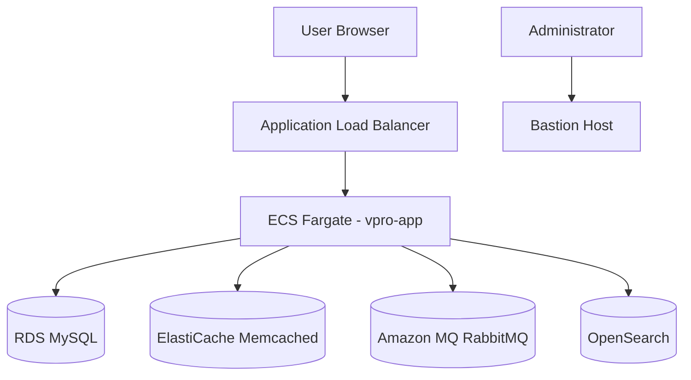
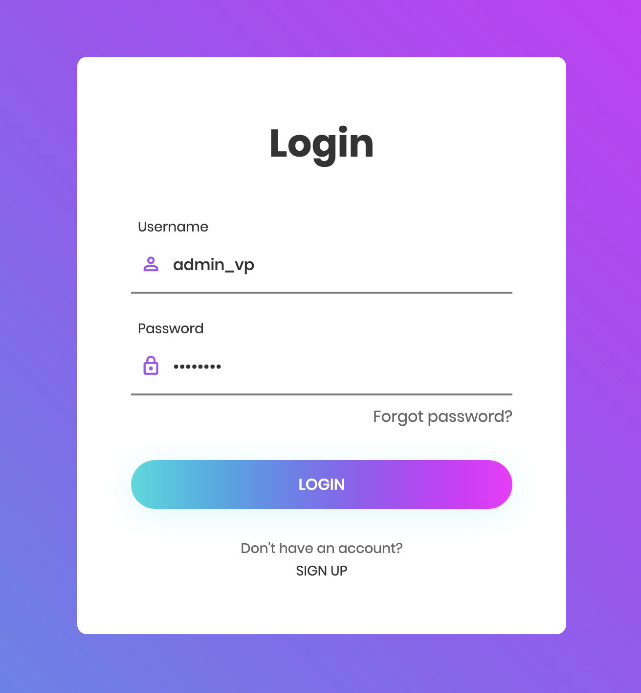
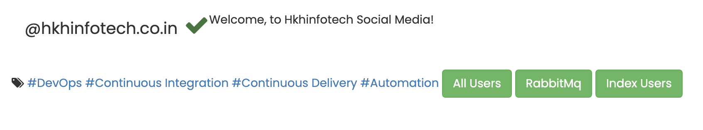
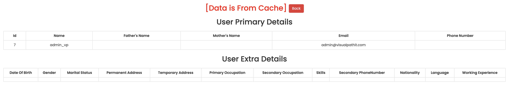
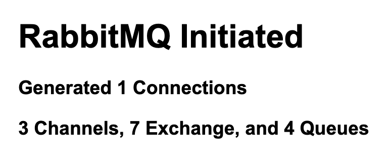
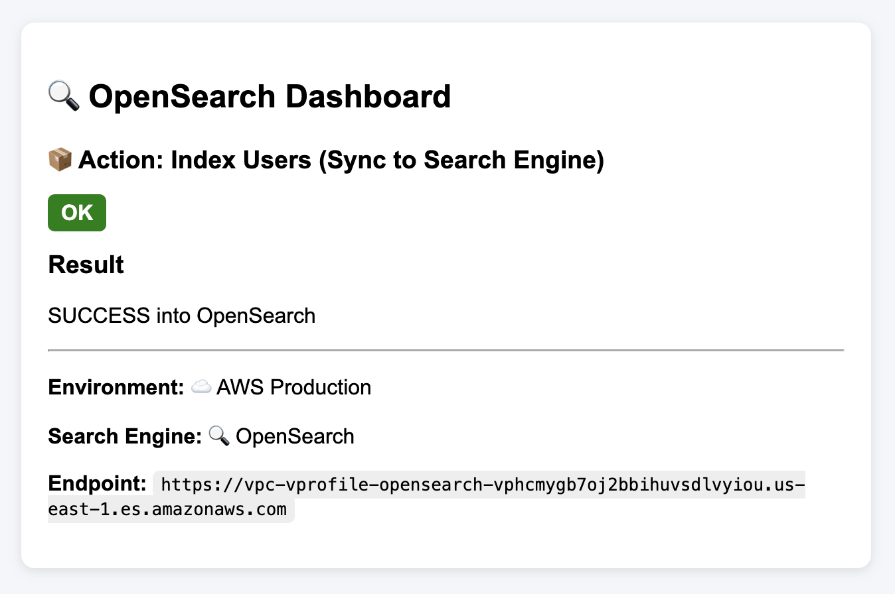
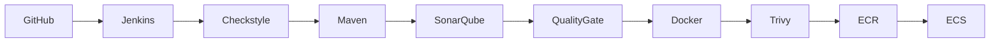

# VProfile - CI/CD DevOps Project

<br>

## 📌 Overview

<br>

This project is a full DevOps CI/CD pipeline for deploying a Java Spring-based application into AWS ECS using Terraform, Jenkins, Docker and SonarQube, with an additional option to run the entire system locally using Docker Compose.

The goal of this project is to validate integration between multiple services:
- MySQL (RDS)
- Memcached
- RabbitMQ
- OpenSearch
- Jenkins CI/CD pipeline
- SonarQube code analysis

<br>



<br>

### Bastion Host:

The infrastructure includes a dedicated Bastion Host located in the public subnet.

Its primary purpose is to:

- Upload the initial MySQL dump into Amazon RDS.
- Provide secure administrative access to resources inside the VPC.
- Perform troubleshooting and debugging tasks when required.

The Bastion Host is managed through AWS Systems Manager (SSM), allowing secure access without opening SSH ports to the internet.

**Start an SSM session:**

```bash
aws ssm start-session --target <BASTION_INSTANCE_ID>
```

Once connected, the Bastion Host can be used to:
- Import the application database into RDS.
- Verify connectivity to RDS, RabbitMQ, OpenSearch, and other private resources.
- Perform operational troubleshooting inside the VPC.

<br>
<br>
<br>

## 📚 Documentation

- [Jenkins Setup](./Jenkins/README.md)
- [SonarQube Setup](./SonarQube/README.md)
- [Terraform Infrastructure](./terraform/README.md)

<br>
<br>
<br>

## 🏗️ Architecture

This project supports two deployment models:

### Local Environment
- Docker Compose
- Nginx
- Spring Application
- MySQL
- Memcached
- RabbitMQ
- Elasticsearch

### AWS Environment
- Terraform-provisioned infrastructure
- Application Load Balancer (ALB)
- ECS Fargate
- Amazon RDS (MySQL)
- Amazon ElastiCache (Memcached)
- Amazon MQ (RabbitMQ)
- Amazon OpenSearch
- Bastion Host (SSM)

<br>
<br>
<br>

## 🧪 Infrastructure Validation Scenarios

<br>

The application serves as an integration validation platform.

Each feature intentionally interacts with a specific infrastructure component, allowing verification that all services are correctly deployed, connected, and operational.

### 1. *Database Validation:*
**Login page:**
- Username: `admin_vp`
- Password: `admin_vp`

If login succeeds → MySQL connection is working.

<p align="left">
  
</p>

<br>

---

<br>

After login page, on the main page, you will see the following 3 buttons to test the infrastructure components:

<p align="left">
  
</p>

1. **All Users** button → verifies Memcached.
2. **RabbitMQ** button → verifies RabbitMQ.
3. **Index Users** button → verifies Elasticsearch/OpenSearch.

<br>

---

<br>

### 2. *Memcached Validation:*
**After login:**
- Click **All Users** button:
- Click on one of the users Id's (to open a user profile)
- Go back to the previous page and click again on the same user Id

You will see:
- First load: **[Data is From DB and Data Inserted In Cache !!]**
- Second load: **[Data is From Cache]**

This confirms Memcached caching works.

Example screenshot:

<p align="left">
  
</p>

<br>

---

<br>

### 3. *RabbitMQ Validation:*
Click **RabbitMQ** button:

Example screenshot of the expected output:

<p align="left">
  
</p>

<br>

---

<br>

### 4. *OpenSearch Validation:*
Click **Index Users** button:

Example screenshot of the expected output:

<p align="left">
  
</p>

<br>

---

<br>

## 🚀 Deployment Option 1: **Local Docker Compose**

<br>

### Prerequisites:
- Docker
- Docker Compose

### Run full stack locally:

```bash
docker-compose up -d
```

### Includes:

- VProfile project (Java Web Application)
- Nginx (Web layer)
- MySQL
- Memcached
- RabbitMQ
- Elasticsearch

<br>

## 🚀 Deployment Option 2: **Jenkins CI/CD → AWS ECS**

### Initial Setup:

❗ To run the Jenkins CI/CD Pipeline, you should follow the [CI/CD Setup Instructions](docs/Setup_Instructions.md).


Jenkins Pipeline:

- Clone from GitHub
- Run Checkstyle 
- Build WAR with Maven
- SonarQube analysis
- Quality Gate
- Build Docker image
- Trivy Security Scan
- Push to ECR
- Deploy to ECS

<br>

## 📦 Technologies Used

<br>

- Java 17 + Spring
- Maven
- Docker Compose
- Terraform
- Jenkins
- Docker
- SonarQube
- Trivy
- AWS Services:
  - IAM
  - ECR
  - Application Load Balancer
  - ECS Fargate
  - RDS MySQL
  - ElastiCache
  - Amazon MQ
  - OpenSearch
  - Systems Manager (SSM)

<br>

## 📌 Notes:

- This project is intended for DevOps learning and portfolio demonstration only.

<br><br>

## 🙏 Credits:

The application itself is based on the original VProfile project created by **Imran Teli**.

Original project:
https://github.com/hkhcoder/vprofile-project