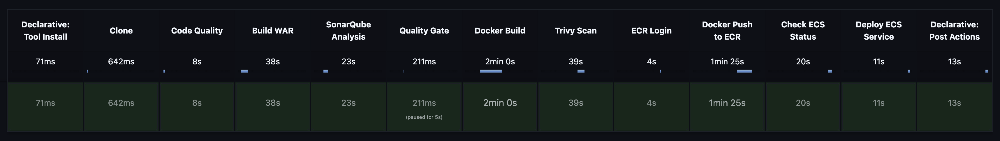
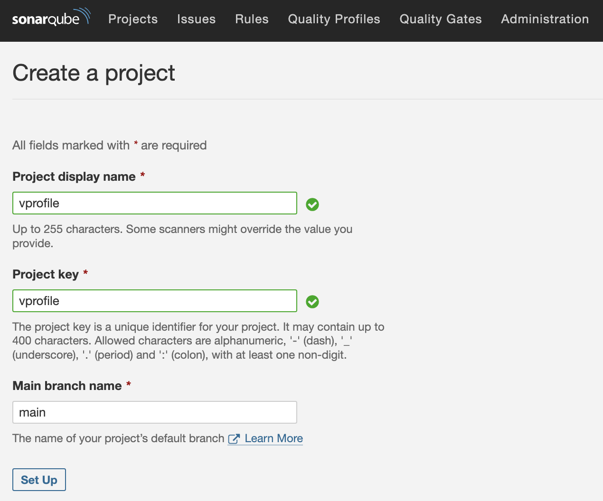
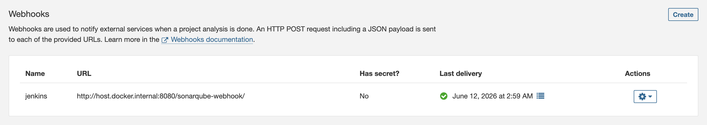
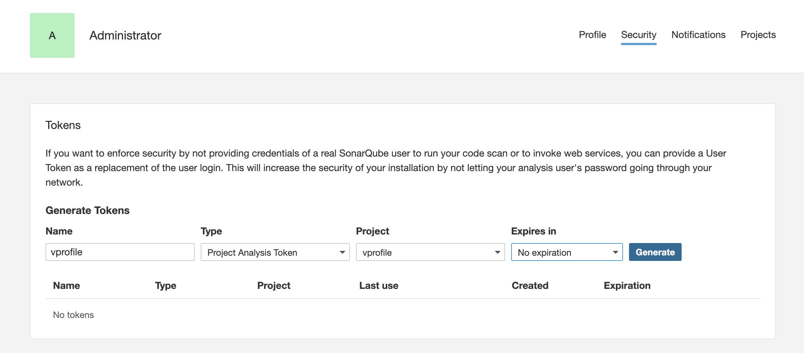
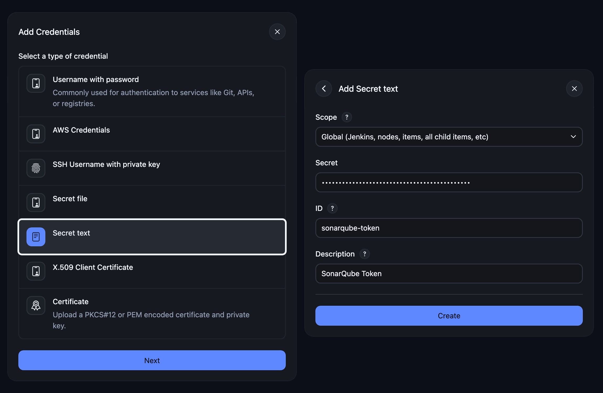
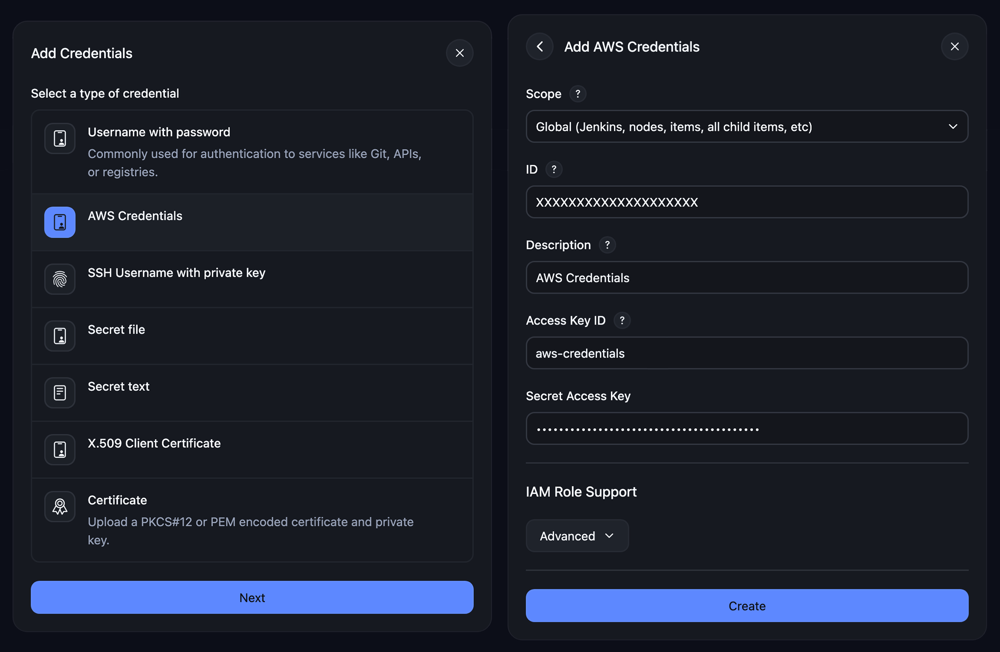
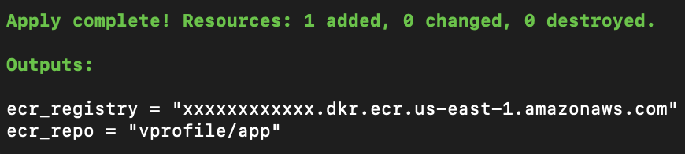
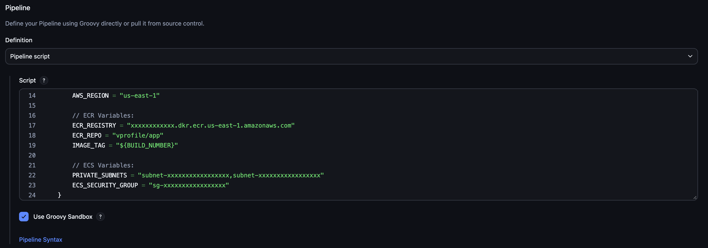
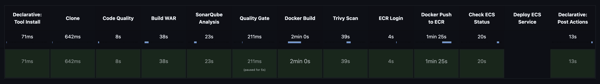
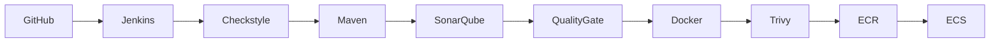

⬅️ [Back to README](../README.md)

---

# CI/CD Pipeline Setup Instructions

This project demonstrates a production-style CI/CD pipeline using Jenkins, SonarQube, Terraform, and AWS ECS for automated build, test, security scanning, and deployment.

Follow the steps below to configure Jenkins, SonarQube, AWS, and Terraform before running the CI/CD pipeline.

<br>

## CI/CD Pipeline Workflow

The pipeline follows a two-stage CI/CD deployment model:

1. Local CI/CD bootstrap environment (Jenkins + SonarQube)
2. AWS infrastructure provisioning and application deployment

The initial pipeline execution establishes the base container image in Amazon ECR. This image is then used by Terraform to initialize the ECS service. Once the infrastructure is provisioned, the CI/CD pipeline operates in a continuous delivery mode.

<br>

## Prerequisites

- Docker
- Docker Compose
- AWS CLI installed and configured with appropriate credentials
- Terraform installed
- Jenkins running
- SonarQube running
- ECR repository created

<br>

## Table of Contents

1. [Start Jenkins Container](#step-1-start-jenkins)
2. [Start SonarQube Container](#step-2-sonarqube-setup)
3. [AWS Configurations](#step-3-aws-configurations)
4. [Create the Amazon ECR Repository](#step-4-create-the-amazon-ecr-repository)
5. [Bootstrap the Deployment](#step-5-bootstrap-the-deployment)
6. [Provision the AWS Infrastructure](#step-6-provision-the-aws-infrastructure)
7. [Future Deployments](#step-7-future-deployments)
8. [Clean-Up](#step-8-clean-up)
- [Deployment Options](#🚀-deployment-options)

<br><br><br>

## Step 1: Start Jenkins




### 1. Start the Jenkins container:


**Run:**

```bash
cd Jenkins
docker-compose up -d
```

❗ This Jenkins Docker Container includes all the neccessary tools to run the pipeline.


Wait until Jenkins is available at: `http://localhost:8080`

<br><br><br>

## Step 2: Start SonarQube Container

SonarQube Code Quality is used for static code analysis in the CI/CD pipeline.

### 2. Start the SonarQube container:

**Run:**

```bash
cd SonarQube
docker-compose up -d
```

### 🚀 Access:

- Wait for SonarQube to be accessible at: http://localhost:9000

Default login:
- Username: `admin`
- Password: `admin`

<br>

### 📦 Project Setup:

#### 3. Create a new project:
- Project Name: `vprofile`

<br>

<p align="left">
  
</p>

<br>

#### 4. Configure a webhook for the jenkins pipeline:

<br>

- Navigate to: **Projects → vprofile → Project Settings → Webhooks**
- Click on **"Create a Webhook"** and configure as follows:
  - Name: `jenkins`
  - URL: `http://host.docker.internal:8080/sonarqube-webhook/`

<br>

<p align="left">
  
</p>

<br>

#### 5. Generate a SonarQube token:

<br>

- Navigate to: **Administrator → My Account**
- Click on the **Security** Tab
- **Generate** a Token, name it `vprofile` 
- Copy the Token to use in Jenkins

<br>

<p align="left">
  
</p>

<br>

### 🔐 Jenkins Integration:

#### 6. Add Sonar Token in Jenkins:
- Navigate to: **Jenkins → Credentials**
- Credential Type: Secret Text
- ID: `sonarqube-token`

<br>

<p align="left">
  
</p>

<br><br><br>

## Step 3: AWS Configurations:

#### 7. Create an IAM user with the required permissions:

- `AmazonEC2ContainerRegistryFullAccess`
- `AmazonEC2FullAccess`
- `AmazonECS_FullAccess`
- `AmazonElastiCacheFullAccess`
- `AmazonMQFullAccess`
- `AmazonOpenSearchServiceFullAccess`
- `AmazonRDSFullAccess`
- `CloudWatchLogsFullAccess`
- `IAMFullAccess`

❗ Or with [AWS Less Privilege](AWS_Less_Privilege.md) Policies.

<br>

#### 8. Create **Access keys** for the IAM User:
- ID: `aws-credentials`
- Access Key ID: AWS Access Key ID
- Secret Access Key: AWS Secret Key

<br>

### 🔐 Jenkins Integration:

#### 9. Add AWS Credentials in Jenkins:
- Navigate to: **Jenkins → Credentials**
- Credential Type: AWS Credentials
- ID: `aws-credentials`

<br>

<p align="left">
  
</p>

<br><br><br>

## Step 4: Create the Amazon ECR Repository:

<br>

  You can use the **terraform-ecr** or you can create it manually from the AWS Console.
  - Repository name: `vprofile/app`

**Run:**

```bash
cd terraform-ecr
terraform init
terraform apply
```
<br>

<p align="left">
  
</p>

<br>

After Terraform completes successfully, copy the `ecr_registry` output value and update the `Jenkinsfile`.

<br>

<p align="left">
  
</p>

<br><br><br>

## Step 5: Bootstrap the Deployment:

The bootstrap phase creates the initial container image in Amazon ECR. Terraform references this image in the ECS task definition to initialize the first deployment.

Once the ECS service is provisioned, subsequent pipeline executions transition into continuous delivery mode, updating the running service with new immutable container versions.

**Run the jenkins pipeline:**



<br><br><br>

## Step 6: Provision the AWS Infrastructure:

Running Terraform creates the following AWS resources:

- VPC (2 Public, 2 Private Subnets)
- ALB
- ECS Cluster (Fargate)
- RDS MySQL
- ElastiCache (Memcached)
- RabbitMQ (Amazon MQ)
- OpenSearch
- Security Groups & IAM roles

All infrastructure is provisioned using Infrastructure as Code (Terraform), ensuring reproducibility, version control, and environment consistency.

❗ Terraform state is a critical component of this system and must be preserved to maintain infrastructure integrity across deployments.
If values are missing, run terraform output or re-apply the configuration to regenerate them.

<br>

**Run:**
```bash
cd terraform
terraform init
terraform apply
```
<br>

The deployment is complete once ECS service is stable and healthy behind the ALB.

You can access it using the Application Load Balancer (ALB) URL (available as the `web_url` output from Terraform).

<br>

### Bastion Host:

The infrastructure includes a dedicated Bastion Host located in a public subnet.

It is primarily used for:

- Initial database seeding into Amazon RDS
- Operational troubleshooting within private AWS resources

Access is performed exclusively via AWS Systems Manager (SSM), eliminating the need for public SSH access and maintaining a zero-public-access security model.

**Start an SSM session:**

```bash
aws ssm start-session --target <BASTION_INSTANCE_ID>
```

Once connected, the Bastion Host can be used to:
- Import the application database into RDS.
- Verify connectivity to RDS, RabbitMQ, OpenSearch, and other private resources.
- Perform operational troubleshooting inside the VPC.

<br><br><br>


## Step 7: Future Deployments:

Future deployments rely on runtime parameters generated by Terraform during infrastructure provisioning.

These values are retrieved via terraform output and injected into the Jenkins pipeline configuration to ensure consistency between CI/CD and cloud infrastructure state.

Required outputs:

- `private_subnets`
- `ecs_security_group`

If any of these values are missing, rerun terraform output or check the Terraform state.

Update the following variables in the `Jenkinsfile`:

```groovy
environment {

    AWS_REGION = "us-east-1"

    ECR_REGISTRY = "xxxxxxxxxxxx.dkr.ecr.us-east-1.amazonaws.com"
    ECR_REPO     = "vprofile/app"
    IMAGE_TAG    = "${BUILD_NUMBER}"

    PRIVATE_SUBNETS   = "subnet-xxxxxxxx,subnet-xxxxxxxx"
    ECS_SECURITY_GROUP = "sg-xxxxxxxx"
}
```

These values are used during the ECS deployment process to launch application tasks in the private subnets and attach the correct security group.

❗ If values are missing, run `terraform output` or re-apply the configuration.

<br>

**Commit and push** your application changes, then run the Jenkins pipeline again.

<br>

**Run the jenkins pipeline again:**


The pipeline is fully idempotent, all infrastructure is managed using Infrastructure as Code (Terraform), repeated executions produce consistent infrastructure and application state.

<br><br><br>

## Step 8: Clean-Up:

Destroy resources in the following order:

- **Terraform Infrastructure**
- **Amazon ECR Repository**
- **Jenkins Container**
- **SonarQube Container**

<br>

**Run:**

```bash
cd terraform
terraform destroy

cd ../terraform-ecr
terraform destroy

cd ../Jenkins
docker-compose down

cd ../SonarQube
docker-compose down
```

❗ Always destroy resources in reverse order of creation to avoid dependency conflicts.

<br><br><br>

## 🚀 Deployment Options:

This project supports both local development and production-grade AWS deployments, ensuring consistent behavior across environments.

### Option 1: Local Docker Compose

#### Prerequisites:
- Docker
- Docker Compose

#### Run full stack locally:

```bash
docker-compose up -d
```

#### Includes:

- VProfile project (Java Web Application)
- Nginx (Web layer)
- MySQL
- Memcached
- RabbitMQ
- Elasticsearch

<br>

### Option 2: Jenkins CI/CD → AWS ECS

#### Initial Setup:

❗ To run the Jenkins CI/CD Pipeline, you should follow the CI/CD Setup Instructions in this Documentation.

This pipeline represents the full CI/CD lifecycle used in this project:


Jenkins Pipeline:

- Clone from GitHub
- Run Checkstyle 
- Build WAR with Maven
- SonarQube analysis
- Quality Gate
- Build Docker image
- Trivy Security Scan
- Push to ECR
- Deploy to ECS

<br><br><br>

## 📌 Note:

⚠️ For demonstration purposes, sensitive values are stored in a local `.env` file. In production environments, use AWS Secrets Manager or AWS Systems Manager Parameter Store.

<br><br>

---

⬅️ [Back to README](../README.md)