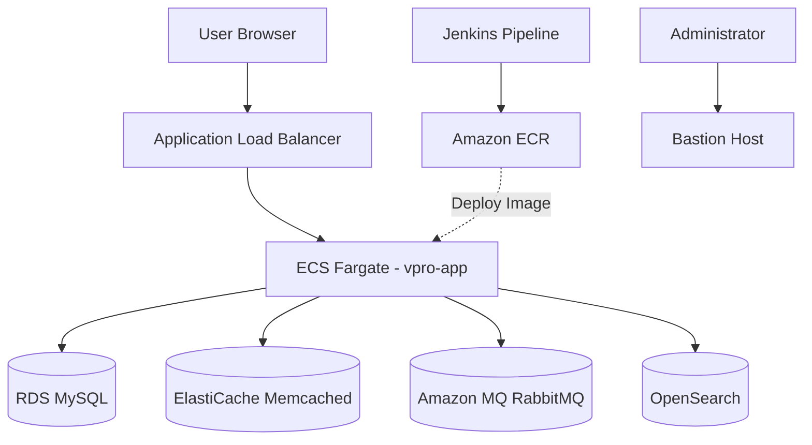

# Terraform Infrastructure (AWS)

## 📌 Overview

This Terraform configuration provisions the complete AWS infrastructure required to deploy the VProfile application on Amazon ECS using Infrastructure as Code (IaC).

<br>

## 🏗️ Architecture




<br>

## 🛠️ Infrastructure Components

### Networking
- VPC
- Public and Private Subnets
- Internet Gateway
- NAT Gateway
- Route Tables
- Security Groups
- Bastion Host (AWS Systems Manager)

<br>

### Compute
- ECS Cluster (AWS Fargate)
- ECS Service
- ECS Task Definition

<br>

### Database
- RDS MySQL

<br>

### Caching
- ElastiCache (Memcached)

<br>

### Messaging
- Amazon MQ (RabbitMQ)

<br>

### Search
- Amazon OpenSearch Service

<br>

### Monitoring
- Amazon CloudWatch Logs

<br>

## 🔧 Bootstrap Process

The ECS task definition references a container image stored in Amazon ECR. Therefore, the Jenkins pipeline must first publish the initial container image before Terraform can provision the ECS service.

<br>

## 🚀 Deployment

Initialize the Terraform working directory and provision the infrastructure:

```bash
cd terraform
terraform init
terraform plan
terraform apply
```

<br>

## 📤 Terraform Outputs

The following outputs are generated after a successful deployment:

- `web_url`
- `private_subnets`
- `ecs_security_group`
- `ecr_registry`

These outputs are consumed by the Jenkins pipeline to deploy new application versions.

<br>

## ⚙️ Key Files

- alb.tf
- bastion.tf
- ecs-task.tf
- ecs.tf
- iam.tf
- memcached.tf
- networking.tf
- opensearch.tf
- outputs.tf
- providers.tf
- rabbitmq.tf
- rds.tf
- security.tf
- variables.tf

<br>

## 🔐 IAM Roles

Terraform creates the following IAM roles required by Amazon ECS:

- ECS Task Execution Role
- ECS Task Role

<br>

## 📌 Notes

All infrastructure components are deployed within a dedicated Amazon VPC. Private resources communicate over internal networking, while external traffic is routed through the Application Load Balancer.

<br>

---

⬅️ [Back to README](../README.md)